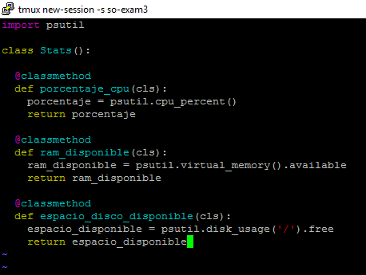
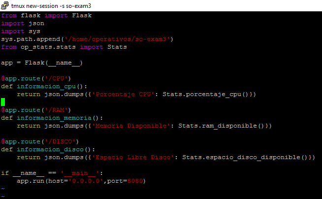
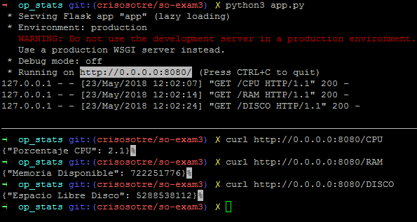
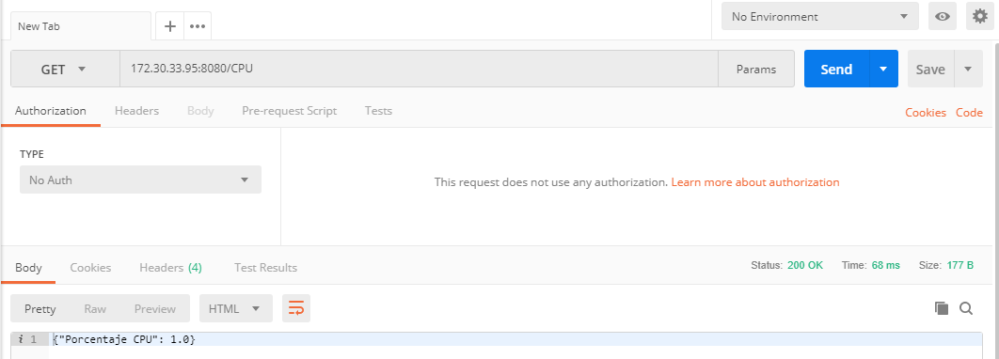
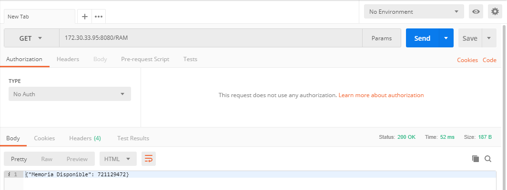
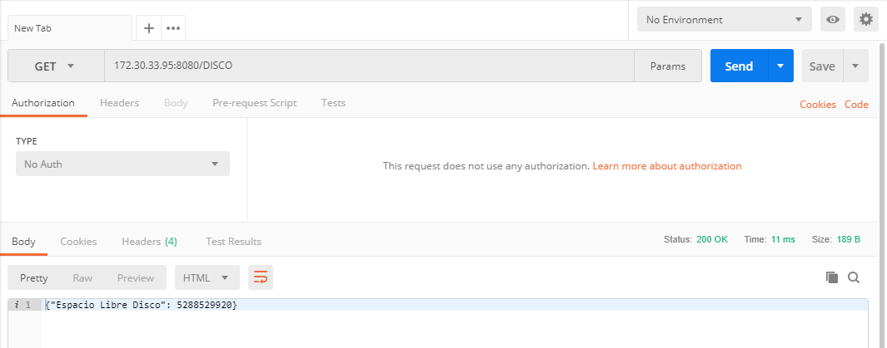

# Examen Parcial 3

**Curso:** Sistemas Operacionales  
**Estudiante:** Cristian Osorio Trejos  
**Código:** A00056436  
**Correo:** crisosotre@hotmail.com  
**URL:** [https://github.com/crisosotre/so-exam3/tree/crisosotre/so-exam3](https://github.com/crisosotre/so-exam3/tree/crisosotre/so-exam3) 

## Descripción

El tercer parcial del curso sistemas operativos trata sobre comandos de Linux, implementación de programas en python3, diseño e implementación de APIs REST y pruebas unitarias.

Este documento será subido al siguiente repositorio: [https://github.com/ICESI-Training/so-exam3](https://github.com/ICESI-Training/so-exam3)

## Desarrollo

### Punto 3

se crean los archivos de texto requirements.txt y requirements_dev.txt que contienen las dependencias necesarias, para implementar el servicio web Flask. Además de estos archivos se crean los archivos stats.py y app.py, de los cuales, el primero tendra la clase Stats con las librerias necesarias para llamar a los metodos necesarios para brindar información sonbre la maquina como CPU, RAM y Disco. El segundo es el que através de Flask consumirá los servicios de la clase Stats, este archivo es el que se ejecutará para mostrar la información que necesitamos.

**Creamos el archivo stats.py en la carpeta op_stats** (esta carpeta se encuentra en este repositorio con el respectivo archivo).

utilizamos el comando ```$ vi stats.py```



Aqui vemos la clase Stats, que contiene los metodos necesarios para brindarnos información sobre el consumo de la CPU, la memoria RAM disponible y el espacio de disco disponible. Para esto es necesario importar la libreria psutil de python la cual nos permite obtener la información que necesitamos, en nuestro caso de CPU, RAM y Disco.

**Creamos el archivo app.py en la carpeta op_stats** (esta carpeta se encuentra en este repositorio con el respectivo archivo).

utilizamos el comando ```vi app.py```



Este archivo expone los servicios del servicio web flask, para obtener el consumo de cpu, la memoria disponible y el espacio de disco disponible.Para cada método, se especifica la URL que sera invocada cuando necesitemos consumir alguno de los servicios expestos. Aquí en este archivo se importa Flask para poder consumir los servicios de la clase Stats. Por último, se configura el puerto por el cual serán expuestos los servicios.

**Ejecutamos el archivo app.py** con el comando ```python3 app.py```



Dividimos la pantalla y por medio del comando ```curl``` hacemos las peticiones para consumir cada servicio en la dirección ip 0.0.0.0 en el puerto 8080.

```curl http://0.0.0.0:8080/CPU``` para consumir el servicio que retorna el porcentaje de la CPU.  
```curl http://0.0.0.0:8080/RAM``` para consumir el servicio que retorna la memoria disponible.  
```curl http://0.0.0.0:8080/DISCO``` para consumir el servicio que retorna el espacio de disco disponible. 

#### Utilizando Postman  

Descargamos Postman de su pagina oficial [https://www.getpostman.com/](https://www.getpostman.com/), lo instalamos y procedemos:

Primero debemos saber cuál es la dirección de nuestra máquina virtual con el comando ```ip a```, seguido de eso, ejecutamos el comando ```python3 app.py``` para levantar el servidor con el puerto 8080 disponible y después en Postman ponemos nuestra dirección ip junto con el puerto 8080 y ponemos el servicio que queremos consumir antecediendo un /. Tenemos que tener en cuenta que estamos haciendo una solicitud HTTP por medio de un método GET el cual nos traerá la información que le solicitamos. No utilizamos POST porque no vamos a cambiar el estado del sistema.

```172.30.33.95:8080/CPU```



```172.30.33.95:8080/RAM``` 



```172.30.33.95:8080/DISCO``` 




### Punto 4

Para realizar esto es necesario crear un arhivo de pruebas, este archivo se llamará test_stats.py 

### Punto 5
